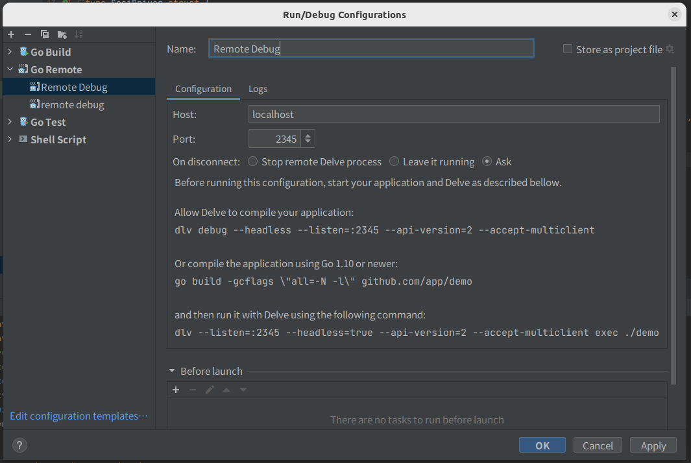
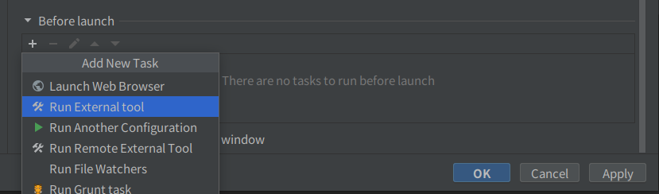

# GoLand

### 1. Make `remote-run.sh`

```bash
#!/bin/bash
GOARCH=amd64 GOOS=windows go build -o temp.exe your/package/name
fgor --connect "192.168.1.2:2344" --token "abcd" exec temp.exe
```

### 2. Add `Go Remote` in Run Configration



### 3. Add External Script



- Add your `remote-run.sh`

### 4. Just One Click!
